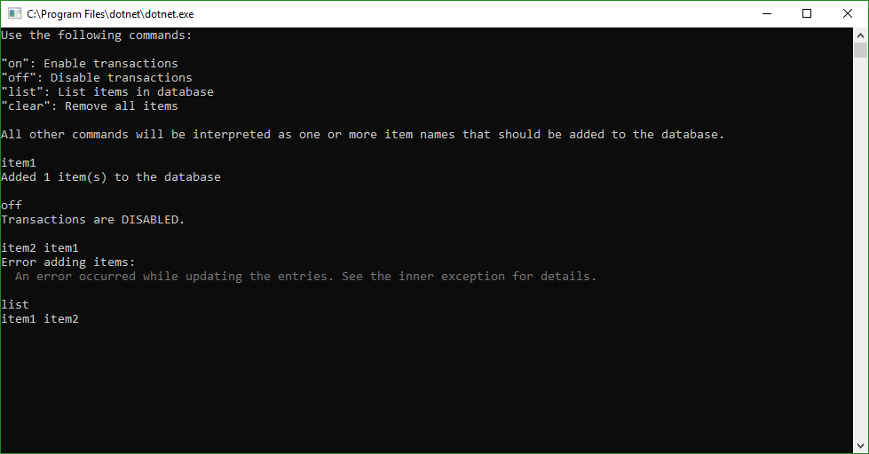
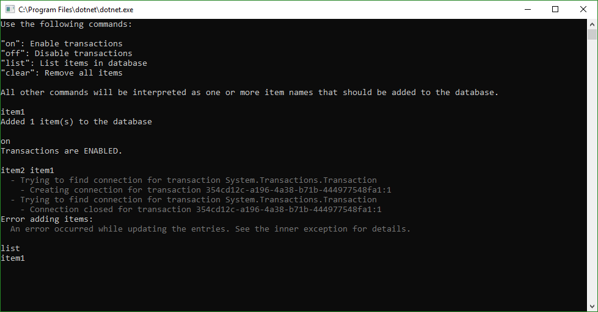

# Entity Framework Core with ambient transactions

Starting with Entity Framework Core 2.1, it is [possible](https://docs.microsoft.com/en-us/ef/core/saving/transactions#using-systemtransactions) to use ambient transactions over multiple database contexts.

The following steps are necessary:

* Add a constructor to your [DbContext](Sample.EntityFramework/Context.cs) class that allows passing an existing DbConnection.
* Add a constructor to your [manager](Sample.EntityFramework/ItemManager.cs) classes that allows passing a context factory. The managers use it to create a DbContext instances.
* Implement a [ContextFactory](Sample.EntityFramework/TransactionAwareContextFactory.cs) that checks for an existing ambient transaction. If one is present, a new DbConnection is created for this transaction and passed to all new contexts.
* Use TransactionScope in your [business logic](Sample.BusinessLogic/ItemLogic.cs) classes when multiple manager methods need to be completed in a transaction.

## Sample application

The sample console application allows testing the behavior with and without transactions.

Without transactions:

First, item1 is added to the database. Then item2 and item1 are added, causing an exception when adding item1 because it already exists. At this point, item2 has already been added though.

With transactions:

Again, item1 is added first, followed by an attempt to add item2 and item1 again. This time though, the exception causes a rollback of the transaction and so item2 isn't added.
